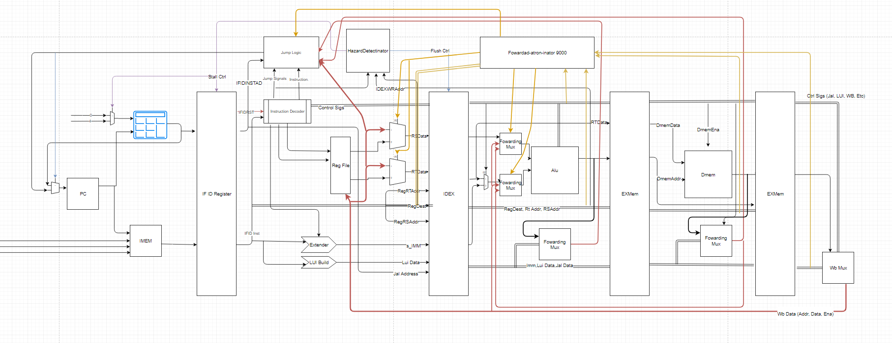

# Processor-design
This was built with Benjammin Pierre and Thomas Beckler

Pipelined CPU- This a pipelined proccessor that runs MIPS assembly code.

Single cycle CPU- Was the first proccessor we built and was able to take in oen instruction at a time.

Learning VHDL - Is basic VHDL programs in order to get used to the syntax

Simple ALU - The top level of this program is the "AddSub". It is an adder and subtractor built into one.

Register File - This is a 32 by 32 bit register file. The main product here is the "MipsProccessor". It is able to proccess Addi, Add,
Sub, and Subi with the 32 bit regitsers made in the register file. 

Memory Interface - This is building onto the last proccessor and is able to do the previous instructions and lw and sw 
